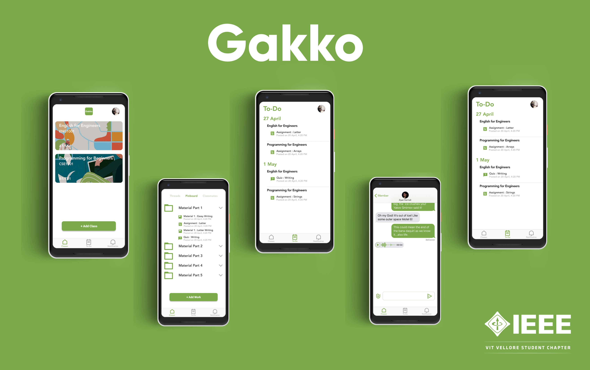

# Gakko - The Classroom App
**Gakko - The Classroom App** is a free non-profit online learning platform to bring together teachers, tutors, mentors and students 
outside their education institution. It promises a completely virtual classroom experience and helps faculties and students learn outside 
of the classroom. It's stacked with helpful features aimed at improving your productivity and communication.

## Screenshots

## How is this built?
This app is 100% written in **Kotlin**.  **MVVM architecture** is used with **Android Architecture Components** and **Kodein** for dependency injection.

## Features
* Simply invite students to join a class through their phone numbers.
* Posting options include questions, assignments, or announcements.
* It helps to keep students well organized with the To-Do feature.
* Includes a feature to converse in threads to overcome spamming.
* Private messaging feature to communicate with anyone anytime.

## Components used
* **Lifecycle** - Used by LiveData.
* **LiveData** - For observing the data in ViewModel.
* **ViewModel** - For managing UI data.
* **Navigation** - For simplifyed navigation through fragments.

## Other libraries/services used
* **Glide** - For loading images into ImageView.
* **Gson** - For converting JSON to POJO and vice versa.
* **Kodein** - For Dependency Injection.
* **Firebase** - For data storage and real-time data streaming.

## Developers
* **Hemanth Krishna** [(@DarthBenro008)](https://github.com/DarthBenro008)
* **Vibhor Chinda** [(@VibhorChinda)](https://github.com/VibhorChinda)

## Designers
* **Harsha Kumar** [(@HarshaKumar23)](https://github.com/HarshaKumar23)
* **Madhav Rajesh**

### [Download this app from Google Play Store](https://play.google.com/store/apps/details?id=com.ieeevit.gakko&hl=en_US)